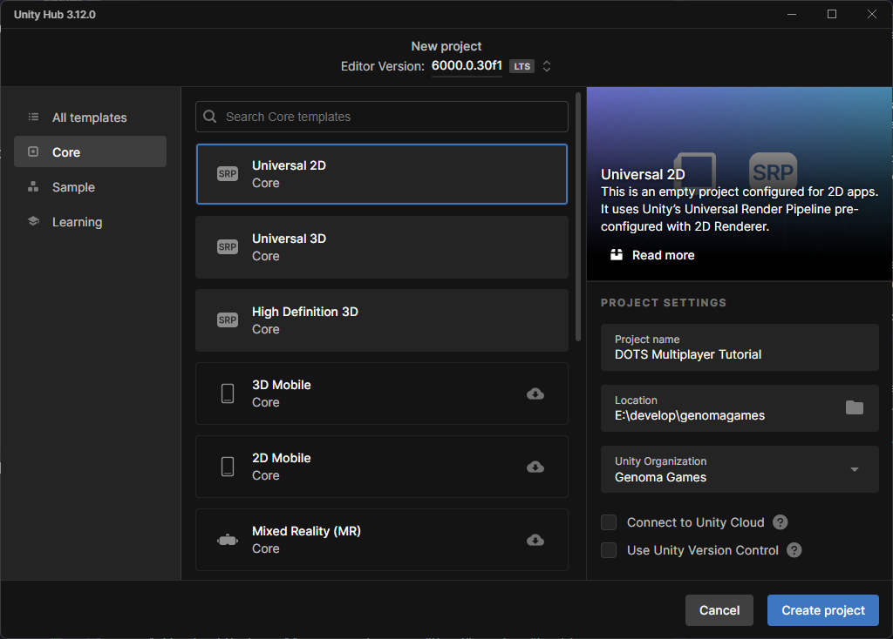

# Cómo crear un juego multijugador en Unity DOTS con ECS - Parte 1: Introducción y Configuración

- **Prerrequisitos**: Conocimientos básicos de Unity y C#
- **Versión de Unity**: Unity 6

## Introducción

¿Imaginas poder crear un juego multijugador con **miles de entidades** moviéndose simultáneamente con unos FPS estables? [Unity DOTS (Data-Oriented Technology Stack)](https://unity.com/dots) lo hace posible, revolucionando cómo desarrollamos videojuegos de alto rendimiento.

En esta serie de tutoriales, te guiaré paso a paso para dominar esta arquitectura y crear un sistema multijugador escalable utilizando un enfoque orientado a datos. Este primer tutorial introducirá en los fundamentos de DOTS, te mostrará por qué es crucial para juegos con gran cantidad de entidades, y te acompañará en la configuración inicial de tu proyecto.

Al finalizar este tutorial, no solo comprenderás los componentes esenciales de DOTS, sino que tendrás tu entorno listo para comenzar a construir experiencias multijugador que antes parecían imposibles de alcanzar con el rendimiento tradicional de Unity.

## 1. Fundamentos de DOTS

### 1.1 El rendimiento en videojuegos modernos

Los videojuegos actuales enfrentan un reto constante: **crear mundos más complejos e inmersivos sin sacrificar rendimiento**. Este desafío se manifiesta en dos limitaciones técnicas principales:

| Limitación | Descripción                                                     | Síntomas                                              | Ejemplos                                                                 |
| ---------- | --------------------------------------------------------------- | ----------------------------------------------------- | ------------------------------------------------------------------------ |
| **CPU**    | Las lógicas del juego, físicas y cálculos saturan el procesador | Caídas de FPS durante cálculos intensivos             | Simulaciones de multitudes, IA compleja, físicas detalladas              |
| **GPU**    | Los gráficos y efectos visuales provocan cuellos de botella     | Ralentizaciones durante escenas visualmente complejas | Efectos de partículas, iluminación avanzada, texturas de alta resolución |

En juegos multijugador, **la CPU suele ser el factor limitante crítico**. Esto se debe a la necesidad de:

- Gestionar numerosas entidades simultáneamente
- Mantener sincronización constante entre jugadores
- Procesar lógicas de juego complejas en tiempo real

Uno de los problemas en la arquitectura tradicional de Unity (basada en [programación orientada a objetos](https://es.wikipedia.org/wiki/Programaci%C3%B3n_orientada_a_objetos)) es la **gestión de memoria**. Cuando los datos relacionados están dispersos (como ocurre en la jerarquía de GameObjects), se producen "fallos de caché" que degradan drásticamente el rendimiento.

> **¿Sabías que?** Un fallo de caché puede costar entre 100-1000 ciclos de CPU, mientras que un acierto de caché solo requiere 1-3 ciclos.

A medida que un juego crece en complejidad, estos problemas se magnifican exponencialmente, resultando en:

- Caídas severas de FPS
- Mayor consumo de memoria
- Experiencia de juego pobre
- Limitaciones en la escala del mundo y número de jugadores

### 1.2 Enfoque orientado a objetos vs. enfoque orientado a datos

Para entender la diferencia entre estos enfoques, imagina dos bibliotecas diferentes, cada una con miles de libros:

#### Biblioteca Orientada a Objetos

- Cada libro es una **unidad completa y autosuficiente** (como un GameObject)
- Los libros están organizados por temas generales, pero dispersos físicamente
- Para obtener información sobre los autores de 100 libros específicos:
  1. Debes localizar cada libro individualmente (dispersos por toda la biblioteca)
  2. Sacar cada libro del estante
  3. Abrirlo y buscar la página con la información del autor
  4. Anotar la información
  5. Devolver el libro y repetir 99 veces más

Este constante ir y venir es muy ineficiente, similar a cómo la CPU debe "saltar" por la memoria para procesar GameObjects tradicionales.

#### Biblioteca Orientada a Datos

- Los datos están organizados por **características específicas**
- Existe un registro centralizado para cada tipo de información:
  - Un catálogo único de autores
  - Un catálogo único de títulos
  - Un catálogo único de géneros
- Para obtener información sobre los autores de 100 libros:
  1. Simplemente consultas el registro de autores
  2. Recorres secuencialmente las entradas que necesitas
  3. Toda la información está contigua y organizada

Este enfoque aprovecha la "[coherencia de caché](https://es.wikipedia.org/wiki/Coherencia_de_cach%C3%A9)", permitiendo al procesador cargar datos relacionados en secuencia, reduciendo drásticamente los tiempos de acceso.

**Comparación de rendimiento:**

- **Arquitectura tradicional:** ~1,000 entidades con FPS estables
- **Arquitectura DOTS:** ~100,000 entidades con los mismos FPS (100x más)

### 1.3 Breve historia de DOTS en Unity

DOTS ha evolucionado significativamente desde su introducción en 2018:

- **2018**: Primera preview de ECS y Job System
- **2019-2021**: Iteraciones continuas, APIs experimentales
- **2022-2023**: Estabilización de APIs, mejoras de rendimiento
- **Unity 6**: DOTS alcanza madurez con APIs estables y listas para producción

Esta evolución ha convertido a DOTS de una tecnología experimental a una solución robusta para el desarrollo de videojuegos que requieren de alto rendimiento.

### 1.4 Cuándo usar DOTS (y cuándo no)

DOTS es ideal para:

- Simulaciones con miles de entidades (como juegos de estrategia en tiempo real o simuladores con multitudes)
- Juegos multijugador masivos (MMOs)
- Proyectos con gran cantidad de entidades o sistemas de partículas
- Juegos que requieren un alto rendimiento en dispositivos móviles

Sin embargo, DOTS podría no ser necesario para:

- Juegos casuales simples
- Videojuegos donde la mecánica principal es la narrativa
- Prototipos rápidos (donde la velocidad de desarrollo es prioritaria)

También se puede realizar una implementación híbrida (usando DOTS solo para sistemas críticos de rendimiento).

## 2. Sistemas principales en Unity DOTS

### 2.1 Sistema de Entidades y Componentes (ECS)

El [Entity Component System (ECS)](https://docs.unity3d.com/Packages/com.unity.entities@latest) es la base de la arquitectura de DOTS, y representa un cambio a cómo se suelen estructurar los proyectos:

**Entidades**: Reemplazan a los GameObjects. Una entidad por sí sola no hace nada; es simplemente un ID único.

**Componentes**: Estructuras que albergan únicamente datos en forma de propiedades, sin lógica. Un ejemplo:

```csharp
public struct Position : IComponentData
{
    public float3 Value;
}

public struct Velocity : IComponentData
{
    public float3 Value;
}
```

**Sistemas**: Clases que contienen la lógica del juego y operan sobre las entidades que tengan componentes específicos.

La diferencia principal con la arquitectura tradicional es la separación completa de la capa de datos (componentes) y la lógica (sistemas), permitiendo un procesamiento más eficiente y paralelo.

### 2.2 Sistema de jobs de Unity

El [Job System](https://docs.unity3d.com/6000.0/Documentation/Manual/job-system.html) permite ejecutar código en paralelo, haciendo uso de todos los núcleos del procesador. Cuenta con las siguientes características:

- **Ejecución multihilo**: Distribuye el trabajo automáticamente entre los hilos de procesamiento disponibles
- **"Work stealing"**: Equilibra automáticamente la cantidad de tareas repartidas entre los diferentes subprocesos
- **Mecanismos de seguridad**: Previene condiciones de carrera y otros problemas de concurrencia
- **Dependencias**: Permite especificar el orden de ejecución cuando es necesario

Usando el Job System, podemos realizar operaciones como actualizar la posición de miles de entidades simultáneamente en lugar de hacerlo secuencialmente.

### 2.3 Burst Compiler

El [compilador Burst de Unity](https://docs.unity3d.com/Packages/com.unity.burst@latest) es un [compilador LLVM](https://llvm.org/) especializado que optimiza el código C# para sacarle el máximo rendimiento a la CPU:

- Traduce código C# a instrucciones de máquina optimizadas
- Aprovecha instrucciones vectoriales (SIMD) automáticamente
- Elimina las comprobaciones de seguridad innecesarias
- Optimiza específicamente para la arquitectura CPU del dispositivo

Dependiendo del del proyecto se pueden llegar a obtener mejoras de rendimiento de 2x a 20x usando Burst. Sin embargo, añade algunas restricciones, como evitar asignaciones dinámicas de memoria y ciertas características de C# como reflexión o delegados.

## 3. Configuración del proyecto

### 3.1 Cómo crear un proyecto en Unity 6 para DOTS

Para comenzar, necesitamos crear un nuevo proyecto en Unity 6:

1. Abre Unity Hub y selecciona "Nuevo proyecto".
2. Selecciona la versión **Unity 6000** (o la más reciente compatible).
3. Selecciona la plantilla **Universal 2D**
4. Dale un nombre como "DOTS-Multiplayer-Tutorial".
5. Elige la ubicación de tu proyecto y haz clic en "Crear proyecto".



<!-- REVISAR: No queremos usar las plantillas mencionadas queremos hacer un proyecto 2D -->

### 3.2 Instalando los paquetes requeridos

<!-- REVISAR: Asegurarse de que los paquetes mencionados son los adecuados -->

Una vez que el proyecto esté abierto, instalamos los paquetes DOTS:

1. Ve a Window > Package Manager
2. Haz clic en "+" y selecciona "Add package by name"
3. Añade cada uno de estos paquetes:
   - `com.unity.entities` (ECS)
   - `com.unity.jobs` (Job System)
   - `com.unity.burst` (Burst Compiler)
   - `com.unity.collections` (Estructuras de datos compatibles con Jobs)

Para este tutorial, recomendamos usar las versiones más recientes y estables de cada paquete. Asegúrate de que las versiones sean compatibles entre sí (generalmente, usar la misma versión mayor para todos).

### 3.3 Configurando los ajustes del proyecto

Optimicemos el proyecto para trabajar con DOTS:

1. Ve a Edit > Project Settings
2. En "Player", establece el Scripting Backend a "IL2CPP" para mejor rendimiento
3. En "Player > Other Settings", habilita "Allow 'unsafe' Code"
4. Desde el Package Manager, selecciona "Burst" y activa "Enable Compilation" si no está activado

### 3.4 Verificando la configuración

Para asegurarnos de que todo está correctamente configurado, crearemos un script de diagnóstico básico. Crea un archivo llamado `DOTSVerification.cs` con el siguiente contenido:

```csharp
using Unity.Entities;
using Unity.Jobs;
using Unity.Burst;
using UnityEngine;

public class DOTSVerification : MonoBehaviour
{
    void Start()
    {
        // Verificar ECS
        EntityManager entityManager = World.DefaultGameObjectInjectionWorld.EntityManager;
        Entity entity = entityManager.CreateEntity();
        Debug.Log($"ECS funcionando: Entidad creada con ID {entity.Index}");

        // Verificar Burst con un job simple
        new VerificationJob().Schedule().Complete();
    }

    [BurstCompile]
    private struct VerificationJob : IJob
    {
        public void Execute()
        {
            Debug.Log("Burst y Job System funcionando correctamente");
        }
    }
}
```

Crea un GameObject vacío en la escena, añade este componente, y ejecuta el juego. Si ves ambos mensajes en la consola, ¡tu configuración DOTS está lista!

## 4. Visión general del proyecto de muestra

### 4.1 Introducción a nuestro proyecto tutorial

Para esta serie de tutoriales, crearemos un sistema de simulación de bandadas (boids) que luego convertiremos en un juego multijugador. Esta elección no es casual:

- Los boids son un ejemplo perfecto de simulación emergente con muchas entidades
- El algoritmo es fácil de entender pero ofrece resultados visualmente interesantes
- Se beneficia enormemente del procesamiento paralelo
- Sirve como base perfecta para un juego multijugador

### 4.2 Objetivos de la simulación de boids

Los boids siguen tres reglas simples:

1. **Separación**: Evitan chocar entre ellos
2. **Alineación**: Tienden a moverse en la misma dirección que sus vecinos
3. **Cohesión**: Se mueven hacia el centro promedio de sus vecinos

Estas simples reglas crean un comportamiento de bandada sorprendentemente realista, como pájaros o peces.

En nuestro caso, representaremos cada boid como una entidad en DOTS, con componentes para posición, velocidad y propiedades de comportamiento.

### 4.3 Requisitos de rendimiento

Nuestros objetivos para este proyecto son:

- Mantener 60+ FPS en dispositivos de gama media
- Soportar al menos 10,000 boids simultáneos
- Sincronizar el estado entre múltiples jugadores
- Minimizar el uso de memoria y ancho de banda

Con la arquitectura tradicional, estos objetivos serían extremadamente difíciles de alcanzar. Con DOTS, son perfectamente factibles.

### 4.4 Hoja de ruta de desarrollo

A lo largo de esta serie de tutoriales:

1. Implementaremos los componentes básicos de ECS (este tutorial)
2. Añadiremos sistemas para el movimiento de boids
3. Optimizaremos con Jobs y Burst
4. Añadiremos representación visual
5. Implementaremos colisiones y interacciones
6. Añadiremos entrada del jugador y control de cámara
7. Implementaremos networking y multijugador
8. Optimizaremos para plataformas específicas
9. Puliremos la experiencia de juego
10. Desplegaremos la versión final

## 5. Primeros pasos

### 5.1 Creando tu primera Entity

Vamos a crear nuestra primera entidad en DOTS. Crea un nuevo script llamado `BoidsSpawner.cs`:

```csharp
using Unity.Entities;
using Unity.Mathematics;
using Unity.Transforms;
using UnityEngine;

public class BoidsSpawner : MonoBehaviour
{
    [SerializeField] private int boidsToSpawn = 100;
    [SerializeField] private float spawnRadius = 10f;

    private class BoidsSpawnerBaker : Baker<BoidsSpawner>
    {
        public override void Bake(BoidsSpawner authoring)
        {
            var entity = GetEntity(TransformUsageFlags.None);
            AddComponent(entity, new BoidsSpawnerComponent
            {
                Count = authoring.boidsToSpawn,
                Radius = authoring.spawnRadius
            });
        }
    }
}

public struct BoidsSpawnerComponent : IComponentData
{
    public int Count;
    public float Radius;
}

public partial struct SpawnBoidsSystem : ISystem
{
    public void OnCreate(ref SystemState state)
    {
        state.RequireForUpdate<BoidsSpawnerComponent>();
    }

    public void OnUpdate(ref SystemState state)
    {
        var spawnerComponent = SystemAPI.GetSingleton<BoidsSpawnerComponent>();
        var random = Random.CreateFromIndex(1234); // Semilla fija para reproducibilidad

        var ecb = new EntityCommandBuffer(Unity.Collections.Allocator.Temp);

        // Crear entidades boid
        for (int i = 0; i < spawnerComponent.Count; i++)
        {
            var entity = ecb.CreateEntity();

            // Posición aleatoria dentro del radio
            float3 position = random.NextFloat3Direction() * random.NextFloat(0, spawnerComponent.Radius);

            // Velocidad inicial aleatoria
            float3 velocity = random.NextFloat3Direction() * 2f;

            // Añadir componentes
            ecb.AddComponent(entity, new LocalTransform
            {
                Position = position,
                Rotation = quaternion.identity,
                Scale = 1f
            });

            ecb.AddComponent(entity, new BoidComponent
            {
                Velocity = velocity
            });
        }

        ecb.Playback(state.EntityManager);
        ecb.Dispose();

        // Desactivar este sistema después de la creación inicial
        state.Enabled = false;
    }
}

public struct BoidComponent : IComponentData
{
    public float3 Velocity;
}
```

### 5.2 Añadiendo componentes básicos

Hemos definido dos componentes principales:

1. `BoidsSpawnerComponent`: Contiene los parámetros para generar boids
2. `BoidComponent`: Almacena las propiedades de cada boid individual

Los componentes en DOTS son estructuras ligeras que solo contienen datos. También estamos usando el componente integrado `LocalTransform` para manejar la posición de cada boid.

### 5.3 Configurando un sistema simple

El sistema `SpawnBoidsSystem` se encarga de crear todas las entidades boid durante la inicialización:

1. Obtiene los parámetros del spawner
2. Crea un búfer de comandos para operaciones en entidades
3. Genera cada boid con posición y velocidad aleatorias
4. Aplica los comandos al EntityManager
5. Se desactiva a sí mismo para no seguir generando boids

Para probarlo, crea un GameObject vacío, añade el componente `BoidsSpawner`, y configura la cantidad de boids a generar.

### 5.4 Ejecución y observación

Al ejecutar la escena, se crearán las entidades boid, pero no veremos nada todavía porque:

1. No tenemos representación visual para los boids
2. No hemos implementado el sistema de movimiento

En tutoriales posteriores, añadiremos estas funcionalidades. Por ahora, puedes verificar que las entidades se hayan creado usando la ventana Entity Debugger (Window > DOTS > Entity Debugger).

## 6. Referencias adicionales

- [Manual de Unity Entities](https://docs.unity3d.com/Packages/com.unity.entities@latest)
- [Manual del Job System](https://docs.unity3d.com/Packages/com.unity.jobs@latest)
- [Manual de Burst](https://docs.unity3d.com/Packages/com.unity.burst@latest)
- [Tutoriales oficiales de DOTS en Unity Learn](https://learn.unity.com/search?k=%5B%22q%3ADOTS%22%5D)
- [Foro oficial de DOTS](https://forum.unity.com/forums/data-oriented-technology-stack.147/)
- [Canal de Discord de Unity ECS](https://discord.gg/unity-ecs)
- [Ejemplos en GitHub](https://github.com/Unity-Technologies/EntityComponentSystemSamples)
- [Curso de Code Monkey sobre Unity DOTS](https://www.youtube.com/watch?v=1gSnTlUjs-s)

## Próximos pasos

En el próximo tutorial, profundizaremos en los fundamentos de ECS e implementaremos el sistema de movimiento para nuestros boids. Aprenderemos a utilizar consultas de entidades, trabajar con datos de componentes y crear sistemas más complejos.

Para practicar lo aprendido, intenta:

- Modificar el spawner para crear diferentes formas iniciales
- Experimentar con diferentes cantidades de boids y observar el rendimiento
- Intentar añadir un componente adicional con alguna propiedad (como color o tamaño)

¡Esperamos verte en el próximo tutorial de esta serie sobre Unity DOTS!
