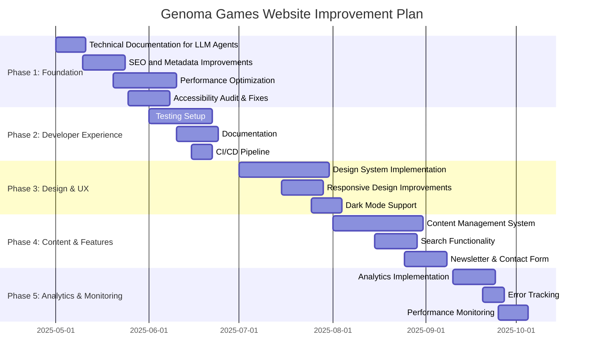

# Implementation Timeline

This document outlines the proposed timeline for implementing the improvements to the Genoma Games website.

## Phase 1: Foundation (May 2025)

### Technical Documentation for LLM Agents (May 1-10, 2025)

- Create architecture overview document
- Document domain model
- Create directory structure guide
- Document data flow
- Add component documentation
- Create development workflow guide
- Document internationalization approach
- Create technical glossary

### SEO and Metadata Improvements (May 10-24, 2025)

- Create Meta component
- Implement structured data
- Update page components
- Enhance sitemap configuration
- Implement security headers
- Improve meta descriptions
- Fix heading hierarchy

### Performance Optimization (May 20-June 10, 2025)

- Implement image optimization
- Add loading states and skeleton screens
- Implement proper font loading
- Optimize third-party script loading
- Implement resource hints

### Accessibility Audit & Fixes (May 25-June 8, 2025)

- Conduct accessibility audit
- Implement proper ARIA attributes
- Ensure keyboard navigation
- Add focus management
- Test with screen readers
- Improve color contrast and text readability

## Phase 2: Developer Experience (June 2025)

### Testing Setup (June 1-21, 2025)

- Implement unit testing
- Add component testing
- Implement end-to-end testing
- Set up continuous integration
- Add visual regression testing

### Documentation (June 10-24, 2025)

- Add comprehensive code documentation
- Create API documentation
- Document component library
- Create contribution guidelines

### CI/CD Pipeline (June 15-22, 2025)

- Set up GitHub Actions
- Implement automated testing
- Configure deployment pipeline
- Add quality checks

## Phase 3: Design & UX (July 2025)

### Design System Implementation (July 1-30, 2025)

- Create design tokens
- Implement component library
- Document design system
- Create design guidelines

### Responsive Design Improvements (July 15-29, 2025)

- Audit responsive behavior
- Improve mobile experience
- Enhance tablet experience
- Test on various devices

### Dark Mode Support (July 25-August 4, 2025)

- Implement color scheme detection
- Create dark mode color palette
- Add theme toggle
- Test dark mode on all pages

## Phase 4: Content & Features (August 2025)

### Content Management System (August 1-30, 2025)

- Evaluate headless CMS options
- Implement selected CMS
- Migrate existing content
- Create content workflows

### Search Functionality (August 15-29, 2025)

- Implement search indexing
- Create search UI
- Add search results page
- Implement search analytics

### Newsletter & Contact Form (August 25-September 8, 2025)

- Create newsletter signup form
- Implement contact form
- Set up email delivery
- Add form validation and spam protection

## Phase 5: Analytics & Monitoring (September 2025)

### Analytics Implementation (September 10-24, 2025)

- Set up privacy-friendly analytics
- Implement event tracking
- Create analytics dashboard
- Document analytics approach

### Error Tracking (September 20-27, 2025)

- Implement error tracking
- Set up alerts
- Create error reporting workflow
- Document error handling procedures

### Performance Monitoring (September 25-October 5, 2025)

- Set up Core Web Vitals monitoring
- Implement real user monitoring
- Create performance dashboard
- Document performance benchmarks
